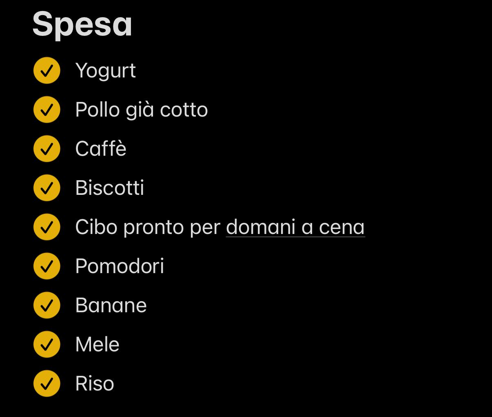

# CIBY Artefatto P01 A01

**Didascalia:** lista digitale "Spesa" fornita per P01, con nove voci tutte spuntate: yogurt, pollo già cotto, caffè, biscotti, cibo pronto per domani a cena, pomodori, banane, mele e riso. P01 dichiara di usarla per i prodotti terminati in casa.

L'immagine documenta l'artefatto, non la sequenza degli acquisti. Le spunte non provano da sole che tutti i prodotti siano stati comprati. La voce "cibo pronto per domani a cena" è coerente con anticipazione a breve termine, senza dimostrare pianificazione settimanale. Non sono osservabili frequenza d'uso, quantità e regole di aggiornamento.

**Fonte:** immagine fornita per P01 e report originale. Codice P01-E10. [Scheda P01](../P01.md).
