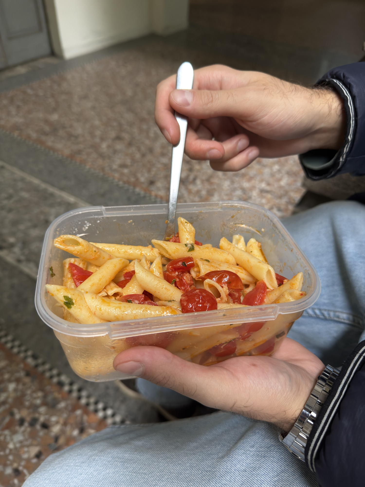

# CIBY Artefatto P03 A01

**Oggetto:** fotografia del pranzo di P03, fornita dal gruppo l'8 ottobre 2026. Andrea Mauro la associa a P03 nella richiesta di revisione.

**Osservazione della foto:** pasta corta con pomodorini e altri elementi non identificabili con certezza, dentro un contenitore trasparente. Sono visibili forchetta, mani, abiti e parte dello spazio circostante; nessun volto o nome è visibile. Non è documentato se l'azione sia spontanea o una dimostrazione richiesta.

**Collegamento alla sessione:** nel segmento T09 della trascrizione automatica, discutendo dei pomodorini, P03 fa riferimento alla pasta che sta mangiando. Questo collega la fotografia al pasto della sessione; non documenta quando e da chi sia stato preparato. Non confondere con il pollo della cena precedente o la pasta di zucchine e guanciale dell'episodio EP04.

**Evidenza:** P03-E14. La foto documenta un pasto in contenitore; non permette di stabilire tutti gli ingredienti, grammature, calorie, valori nutrizionali, modalità di conservazione o origine delle scorte.

**Consenso:** Andrea Mauro conferma l'8 ottobre consenso preventivo e autorizzazione alle immagini; scansione del modulo attesa. Il JPEG è una conversione dell'originale, senza metadati EXIF e con lato massimo di 2000 pixel; l'originale HEIC rimane nei materiali riservati. La copia JPEG è destinata alla condivisione con la scheda; l’originale HEIC resta riservato.

[Scheda P03](../P03.md).
